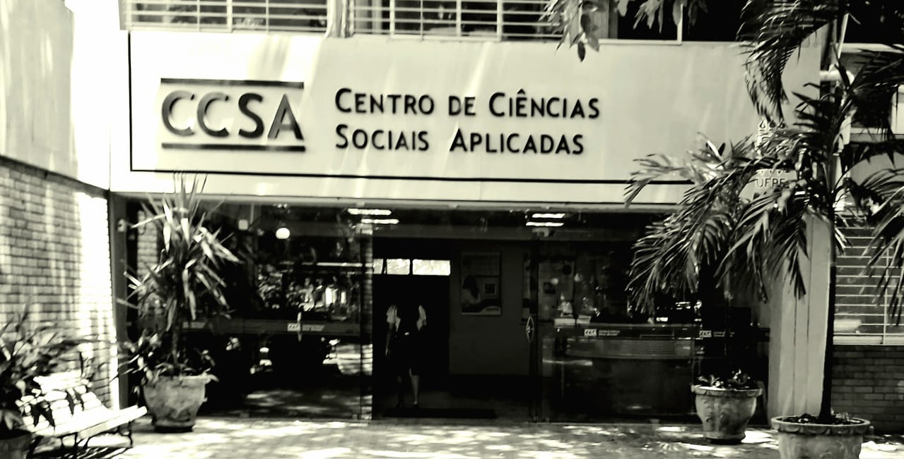

## About Me

I am an Assistant Professor of Economics at the <a style='color: black;' href='https://www.ufpe.br/'>Universidade Federal de Pernambuco</a> since 2023. Previously, I had a wealth of experience as a Postdoctoral Researcher at the Department of Economics of <a style='color: black;' href='http://www.econ.puc-rio.br/'>PUC-Rio</a> (2018-2023) and Operational Coordinator at <a style='color: black;' href='http://www.econ.puc-rio.br/datazoom/index.html'>Data Zoom</a> (2019-2023). I earned my Ph.D. from the <a style='color: black;' href='https://www.ub.edu/school-economics/'>Universitat de Barcelona</a> (2018), and my academic journey includes both a Master's (2012) and Bachelor's (2010) degree from <a style='color: black;' href='https://sites.google.com/view/pimes/'>PIMES/UFPE</a>.

## Academic Interests

My academic interests are intersections between Political Economy, Development Economics, Public Economics, and Environmental Economics. As an applied economist, I like to address questions arising from hypotheses in theoretical models and employ quantitative methods with microdata to conduct my analyses. Essentially, my commitment is to elucidate the complexities of these fields and apply my conclusions to contribute to implementing policies that promote social and economic development.

---

## Research

### Selected publications

  * <a style='color: black;' href='https://www.sciencedirect.com/science/article/pii/S0167268125001180'>Natural disasters and voting behavior under authoritarian regimes: Evidence from the Brazilian shrimp vote</a> <b>Journal of Economic Behavior & Organization</b>, 2025 , Vol. 234 p. 106998. (with Baerlocher, Diogo & Caldas, Renata & Schneider, Rodrigo)

  * <a style='color: black;' href='https://onlinelibrary.wiley.com/doi/full/10.1111/obes.12560'>Drought-Reliefs and Partisanship</a>  <b>Oxford Bulletin of Economics and Statistics</b>, 2024, Vol. 86, p. 187-208. (with Boffa, Federico & Piolatto, Amedeo & Fons-Rosen, Christian)
    * <a style='color: black;' href='https://voxeu.org/article/insights-distributive-politics-new-way-measure-aridity'>Voxeu</a>:  New insights on distributive politics from a new way to measure aridity
    * <a style='color: black;' href='https://github.com/FranciscoCavalcanti/Drought-reliefs-and-Partisanship'>GitHub repository</a>

  * <a style='color: black;' href='http://www.sciencedirect.com/science/article/pii/S0047272718301361'>Popularity shocks and political selection</a> <b>Journal of Public Economics</b>, 2018 , Vol. 165 p. 201-216. (with Daniele, Gianmarco & Galletta, Sergio )

### Working papers

  * <a style='color: black;' href='https://ideas.repec.org/p/usf/wpaper/2026-01.html'>Beyond Appearance: The Socioeconomic and Historical Roots of Racial Identity in Brazil</a> University of South Florida, Department of Economics Working Papers, 2026 (with Baerlocher, Diogo & Caldas, Renata)

  * <a style='color: black;' href='https://economics.ucr.edu/docs/helfand/Helfand%20Determinants%20of%20Total%20Factor%20Productivity%20Growth%20%20draft%2010-2025.pdf'>Total Factor Productivity Growth in Brazilian Agriculture (1985-2017): The Roles of Climate Change and Public Policy</a> IDB Working Paper, 2025 (with Helfand, Steven & de Freitas, Christiano & Moreira, Ajax)

  * <a style='color: black;' href='https://www.researchgate.net/profile/Ricardo-Carvalho-10/publication/383129940_Do_Landslides_Impact_Urbanization_Patterns_Evidence_from_Brazilian_Cities/links/66be0c688d0073559255b1e4/Do-Landslides-Impact-Urbanization-Patterns-Evidence-from-Brazilian-Cities.pdf'>Do Landslides Impact Urbanization Patterns? Evidence from Brazilian Cities</a> 2024 (with Lima, Ricardo & Alves, Pedro & Barsanetti, Bruno)

  * <a style='color: black;' href='https://economics.ucr.edu/docs/helfand/Helfand%20Climate%20Change,%20Drought,%20and%20Ag%20Prod%20in%20Brazil%208-2024.pdf'>Climate Change, Drought, and Agricultural Production in Brazil</a>  (with Helfand, Steven & Moreira, Ajax)

  * <a style='color: black;' href='http://diposit.ub.edu/dspace/handle/2445/182602'>Ignorance is bliss: voter education and alignment in distributive politics</a> 2021 IEB Working Paper 2021/07 Institut d'Economia de Barcelona (with Boffa, Federico & Piolatto, Amedeo)

  * <a style='color: black;' href='https://mpra.ub.uni-muenchen.de/88317/'>Voters sometimes provide the wrong incentives. The lesson of the Brazilian drought industry</a> 2018

  * <a style='color: black;' href='https://www.researchgate.net/profile/Francisco-Cavalcanti-6/publication/319902513_Creative_Class_Human_Capital_and_Urban_Dynamism_Empirical_Evidence_for_the_Brazilian_Cities/links/59c0dbdaaca272aff2e4efb0/Creative-Class-Human-Capital-and-Urban-Dynamism-Empirical-Evidence-for-the-Brazilian-Cities.pdf'>Creative Class, Human Capital and Urban Dynamism: Empirical Evidence for the Brazilian Cities</a> 2016 Anais do XLII Encontro Nacional de Economia [Proceedings of the 42nd Brazilian Economics Meeting], No. 160 (with & Silveira-Neto, Raul da Mota)

### Work in progress

  * <a style='color: black;' href=''>Droughts, Sanitation Provision, and Access to Services in Brazil</a> (with Soares, Thayla & Azevedo, Paulo Furquim)

  * <a style='color: black;' href=''>Education and Job Security in Times of Crisis: A Study on the Differential Impact of the COVID-19 Pandemic in Brazil</a> (with Didier, Fredie & Gonzaga, Gustavo)

  * <a style='color: black;' href=''>Mobile broadband expansion and tasks: Evidence from Brazilian formal labor markets</a> (with Mota, Henrique & Gonzaga, Gustavo)

  * <a style='color: black;' href=''>Drought and Corruption</a>

### Technical reports and other publications

  * Cavalcanti, Francisco & Gonzaga, Gustavo <a style='color: black;' href='https://amazonia2030.org.br/desigualdades-no-mercado-de-trabalho-por-raca-evidencias-para-a-amazonia-legal/'>Desigualdades no Mercado de Trabalho por Raça: Evidências para a Amazônia Legal</a> 2022-06 Projeto Amazônia 2030 , No. 42 p. 42

  * Cavalcanti, Francisco & Gonzaga, Gustavo <a style='color: black;' href='https://amazonia2030.org.br/desigualdades-no-mercado-de-trabalho-por-genero-evidencias-para-a-amazonia-legal/'>Desigualdades no Mercado de Trabalho por Gênero: Evidências para a Amazônia Legal</a>  2022-04 Projeto Amazônia 2030 , No. 36 p. 42

  * Alfenas, Flávia &  Cavalcanti, Francisco & Gonzaga, Gustavo <a style='color: black;' href='https://amazonia2030.org.br/dinamismo-de-emprego-e-renda-na-amazonia-legal-ocupacoes-qualificadas-e-de-lideranca/'>Dinamismo de Emprego e Renda na Amazônia Legal: Ocupações Qualificadas e de Liderança </a>  2021-08 Projeto Amazônia 2030 n. 15

  * Alfenas, Flávia &  Cavalcanti, Francisco & Gonzaga, Gustavo <a style='color: black;' href='https://amazonia2030.org.br/dinamismo-de-emprego-e-renda-na-amazonia-legal-servicos/'>Dinamismo de Emprego e Renda na Amazônia Legal: Setor Serviços</a>  2021-08 Projeto Amazônia 2030 n. 14

  * Alfenas, Flávia &  Cavalcanti, Francisco & Gonzaga, Gustavo <a style='color: black;' href='https://amazonia2030.org.br/dinamismo-de-emprego-e-renda-na-amazonia-legal-setor-publico/'>Dinamismo de Emprego e Renda na Amazônia Legal: Setor Público</a>  2021-08 Projeto Amazônia 2030 n. 13

  * Alfenas, Flávia &  Cavalcanti, Francisco & Gonzaga, Gustavo <a style='color: black;' href='https://amazonia2030.org.br/dinamismo-de-emprego-e-renda-na-amazonia-legal-agropecuaria/'>Dinamismo de Emprego e Renda na Amazônia Legal: Agropecuária</a>  2021-08 Projeto Amazônia 2030 n. 10

  * Alfenas, Flávia &  Cavalcanti, Francisco & Gonzaga, Gustavo <a style='color: black;' href='https://amazonia2030.org.br/mercado-de-trabalho-na-amazonia-legal-uma-analise-comparativa-com-o-resto-do-brasil/'> Mercado de trabalho na Amazônia Legal: Uma análise comparativa com o resto do Brasil</a>  2020-11 Projeto Amazônia 2030 p. 68

  * Cavalcanti, Francisco & Oliveira, Rodrigo <a style='color: black;' href='/'> Nível e Evolução da Desigualdade de renda na Bahia: uma avaliação do papel da educação e dos programas sociais</a>  Bahia Análise & Dados,  v. 24, p. 89, 2014.

## Teaching

### Universidade Federal de Pernambuco

#### Seminários de Discentes do PIMES -  (2025.2, 2025.1)
#### Economia e Mudança Climática (Tópicos de Macroeconomia) -  (2026.1, 2025.1)
#### Economia Monetária (2024.2, 2024.2)
#### Economia 12 (2026.1, 2025.1, 2024.1)
#### Microeconomia (2024.1)
#### Introdução a Economia (2023.2)

### Universitat de Barcelona

#### Fundaments de la Fiscalidad (2016.1, 2017.2)
#### Economia (2017.1)

## Curriculum Vitae

If the embedded PDF below does not load, you can <u><a href="../files/Curriculum_Vitae_English.pdf">download it here.</a></u>
 

<embed src="../files/Curriculum_Vitae_English.pdf" type="application/pdf" width="100%" />

For more about my research, publications, and academic journey, please explore the <a style='color: black;' href='https://franciscocavalcanti.github.io/research/'>Research</a> section, <a style='color: black;' href='https://franciscocavalcanti.github.io/teaching/'>Teaching</a> section, and refer to my <a style='color: black;' href='https://franciscocavalcanti.github.io/cv/'>CV</a>